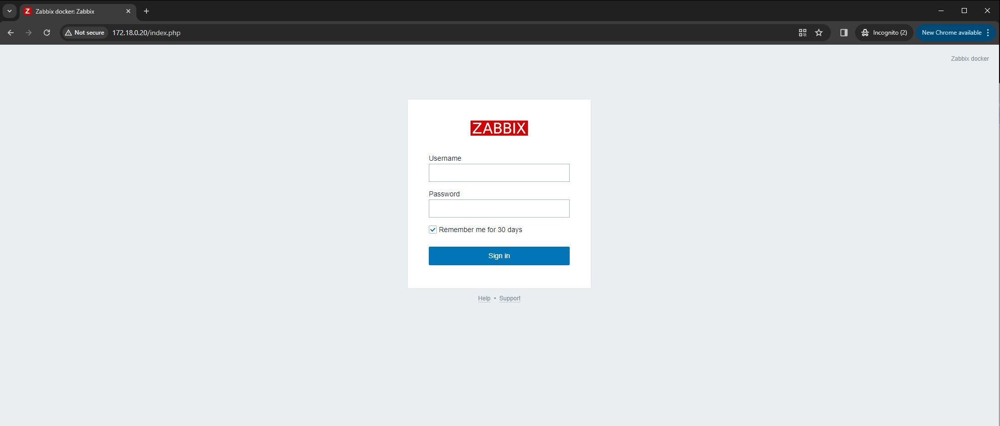
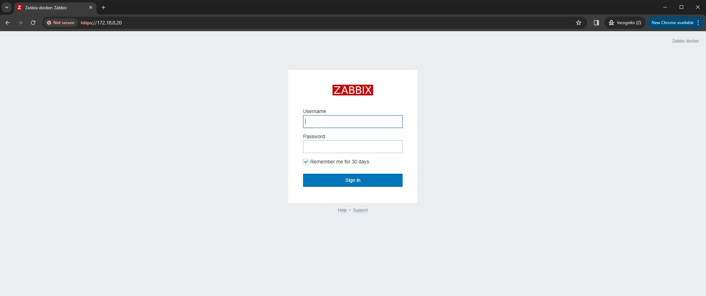

# swc_zabbix6

* This repository contains a script to deploy Zabbix 6.0 LTS via docker containers. For any additional details or inquiries, please contact me at christopher.sargent@sargentwalker.io.
* Tested on Ubuntu 22.04 VM
* [Zabbix Documentation](https://www.zabbix.com/documentation/6.0/en/manual/installation/containers)

# Deploy Zabbix 6.0 LTS
1. ssh user@IP
2. sudo -i 
3. git clone 
4. cd swc_zabbix6
5. vim .env
* Update password
```
# Set your PostgreSQL credentials
POSTGRES_USER=zabbix
POSTGRES_PASSWORD=password
POSTGRES_DB=zabbix
```
6. ./zabbix6_deploy.sh
* Verify .sh scripts are executable chmod +x *.sh
7. docker ps 
```
CONTAINER ID   IMAGE                                             COMMAND                  CREATED         STATUS         PORTS                                                                                NAMES
943a0b13ebd9   zabbix/zabbix-web-nginx-pgsql:alpine-6.0-latest   "docker-entrypoint.sh"   8 minutes ago   Up 5 minutes   0.0.0.0:80->8080/tcp, [::]:80->8080/tcp, 0.0.0.0:443->8443/tcp, [::]:443->8443/tcp   zabbix-web-nginx-pgsql
72a9617e5446   zabbix/zabbix-server-pgsql:alpine-6.0-latest      "/sbin/tini -- /usr/…"   8 minutes ago   Up 8 minutes   0.0.0.0:10051->10051/tcp, :::10051->10051/tcp                                        zabbix-server-pgsql
70668d880d10   zabbix/zabbix-snmptraps:alpine-6.0-latest         "/usr/sbin/snmptrapd…"   8 minutes ago   Up 8 minutes   0.0.0.0:162->1162/udp, [::]:162->1162/udp                                            zabbix-snmptraps
f6639ad51548   postgres:16.2                                     "docker-entrypoint.s…"   8 minutes ago   Up 8 minutes   5432/tcp                                                                             postgres-server

```
8. http://172.18.0.20



# Create certs and dhparam for SSL/TLS
1. openssl req -newkey rsa:2048 -nodes -keyout /etc/ssl/nginx/ssl.key -x509 -days 365 -out /etc/ssl/nginx/ssl.crt
2. openssl dhparam -out /etc/ssl/nginx/dhparam.pem 2048
3. chmod 444 /etc/ssl/nginx/ssl.key
4. docker restart zabbix-web-nginx-pgsql
5. docker logs zabbix-web-nginx-pgsql -f
* Look for the following
```
** Adding Zabbix virtual host (HTTP)
** Enable SSL support for Nginx
** Preparing Zabbix frontend configuration file
########################################################
```
6. https://172.18.0.20



